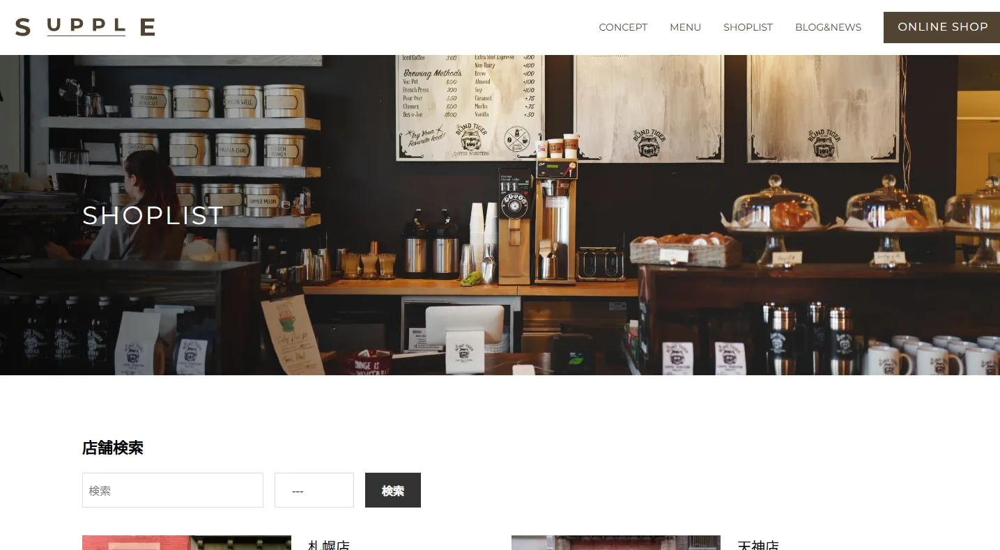

# 🧩 Cafe Site SUPPLE – Web Coding Demo（架空サイト）



## 🔗 Demo

（仮想 URL）
[https://omi758.github.io/matsuyama-clinic-demo/](https://omi758.github.io/matsuyama-clinic-demo/)

&nbsp;

## 📝 Overview（概要）

HelloMentor 課題として制作した **カフェのサービスサイト**です。  
**WordPress テーマとして PHP 化**し、テーマ開発を実施しました。

- WordPress 環境構築（Local）
- テンプレート階層に沿った PHP 化
- エスケープ処理を用いた安全なテンプレート構築
- カスタム投稿タイプ（menu / shoplist）を実装
- 都道府県別の **店舗検索（カスタムフィールド × 絞り込み）** を実装
- editor-style.scss で投稿画面とフロントの見た目を統一
- SEO SIMPLE PACK によるメタ設定
- 必要なプラグイン導入による CMS の最適化
- BEM に基づく CSS 設計 + SCSS 運用

&nbsp;

## 🛠️ Tech Stack（使用技術）

<p align="left">


 
</p>

&nbsp;

## ✨ Features（制作ポイント）

### 1. WordPress テーマ化（PHP によるテンプレート構築）

- header, footer, front-page, archive, single, page などをテンプレート階層に沿って構成
- ループ・条件分岐・カスタムクエリなど WordPress ロジックを実装
- エスケープ処理（`esc_html()` / `esc_url()` など）で安全性に配慮

### 2. 2 つのカスタム投稿タイプ + タクソノミー

- カスタム投稿タイプ **menu（メニュー情報）** と **shoplist（店舗情報）** を実装
- menu には “コーヒータイプ” のタクソノミーを追加し、分類管理
- 投稿の追加／編集／削除はすべて管理画面から可能

### 3. 店舗検索機能（キーワード + 絞り込み検索）

- カスタムフィールドを使用し都道府県別に検索可能

### 4. その他の基本構築

- editor-style.scss により **投稿画面とフロントの見た目を揃えて編集しやすさを向上**  
  管理画面とフロントの表示差異をなくし、クライアントが迷わない編集画面を実現
- パンくずリスト（Breadcrumb NavXT）
- 問い合わせフォームには Contact Form 7 を導入
- EWWW Image Optimizer による画像最適化
- Yoast Duplicate Post によるブログ投稿の複製機能
- レスポンシブ対応（SP・PC）

&nbsp;

## 📂 Directory（主な構成）

```text
.
├── 404.php
├── archive-menu.php
├── archive-shoplist.php
├── footer.php
├── front-page.php
├── functions.php
├── header.php
├── index.php
├── page-consept.php
├── search.php
├── single.php
├── style.css
├── assets
│   ├── css
│   │   ├── editor-style.css
│   │   ├── editor-style.css.map
│   │   ├── style.css
│   │   └── style.css.map
│   ├── img
│   ├── js
│   │   └── main.js
│   └── scss
│       ├── component
│       ├── foundation
│       ├── global
│       ├── layout
│       ├── page
│       │   ├── consept
│       │   ├── error
│       │   ├── menu
│       │   ├── shoplist
│       │   ├── single
│       │   └── top
│       ├── utility
│       ├── editor-style.scss
│       └── style.scss
└── template-parts
    ├── loop-blog.php
    ├── loop-menu.php
    └── loop-shoplist.php
```

## 💻 Development Environment（開発環境）

- Local by Flywheel（WordPress）
- VSCode / GitHub Copilot / Gemini Code Assist
- SCSS / Live Sass Compiler
- ホットリロード環境（node_modules / BrowserSync）

&nbsp;

## ⚠️ Notes（注意事項）

- 本テーマは学習用に制作しています。

&nbsp;
